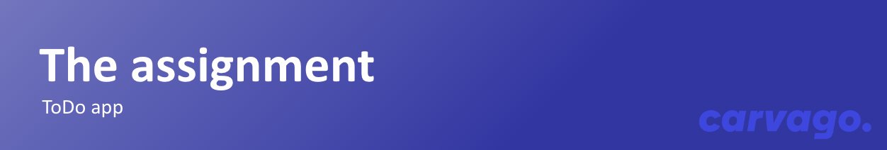

# Quick Overview

- This repository is built on [Create React App](https://github.com/facebook/create-react-app) with TypeScript configuration
- [Chakra UI](https://chakra-ui.com/) is installed as UI framework
- For unit testing, [Jest](https://jestjs.io/) is already installed
- You will use our prettier, eslint, and typescript config for static testing <br/> `npm run eslint && npm run prettify && npm run typecheck`

For a quick start follow these commands

```sh
npm install
npm start
```

Then open [http://localhost:3000](http://localhost:3000/) to see your app.<br>

---



**Your task will be to write a `To-Do app`.** <br/>
You might think a to-do list isn't a challenge, and
that's right, that is why we're gonna make it a little bit harder.

You can use the `Chakra UI` design system with our style theme. This means that you will create the entire task based on the [Figma specification](https://www.figma.com/file/JoD25P1n4ALPTdt1wesM1S/Zentask---Frontend-Assignment?type=design&t=qZXHzbWa37NSYGcn-6).

The assignment will not be completely detailed, i.e. you will have to think about the details. How you handle it is up to you and we will grade you accordingly. You will be given a rough description, and figma specification.

| Requirements                                                                 | What we appreciate                                                                                  | Where we relieve                                                                                                       |
| ---------------------------------------------------------------------------- | --------------------------------------------------------------------------------------------------- | ---------------------------------------------------------------------------------------------------------------------- |
| Chakra UI                                                                    | Statefull fetching                                                                                  | Don't have time to waste with fancy design. Write a simple proof of concept and focus on the logical part of your code |
| Error handling                                                               | Feel free to host the app on [vercel](https://vercel.com/) or [gh-pages](https://pages.github.com/) |                                                                                                                        |
| Responsive design (let's focus on main devices, Desktop, Tablet, and Mobile) | Basic component system (Button, Checkbox, etc.)                                                     |                                                                                                                        |
| Write utility function to get formatted current date and test with jest      | Task feedback from your side, feel free to add comments with questions/explanations/notes           |                                                                                                                        |

### Descriptions

You will create a simple to-do app, with a user login. You will use [DummyJSON](https://dummyjson.com/docs) API to provide dummy API endpoints.

**Don't feel misguided, that the app won't be responsive to the API calls. DummyJson won't update data in BE database, it will just mock the correct response. You can switch between users to see different states of to-dos**

1. First, you will create a login page with the `username` and `password` fields.
   - you will authenticate the user as defined in the [dummyJSON API docs](https://dummyjson.com/docs/auth) and get the user `authorization token` as well as `id`
   - example credentials
   ```json
   {
     "username": "atuny0",
     "password": "9uQFF1Lh"
   }
   ```
2. Then you create a simple todo list with all todos assigned to [logged-id user](https://dummyjson.com/docs/users) with an authorization token
3. Each todo has quick actions button, that will reveal delete and complete actions
4. On todo click, you will be redirected to the todo detail page
5. On the todo detail page, you see todo in full length and have options to edit the todo as well as delete and mark it as completed

## Important links

- [DummyJSON](https://dummyjson.com/docs)
- [Figma specification](https://www.figma.com/file/JoD25P1n4ALPTdt1wesM1S/Zentask---Frontend-Assignment?type=design&t=qZXHzbWa37NSYGcn-6)
- [Chakra UI](https://chakra-ui.com/)
- [Jest](https://jestjs.io/)

**That's it! Good luck!**
